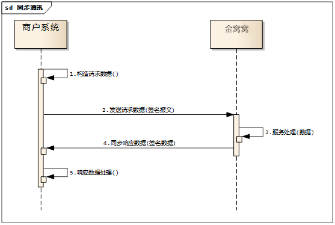
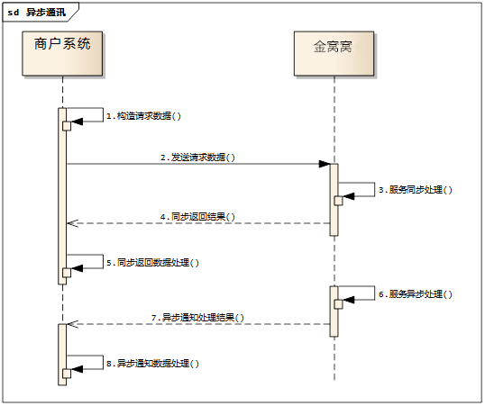
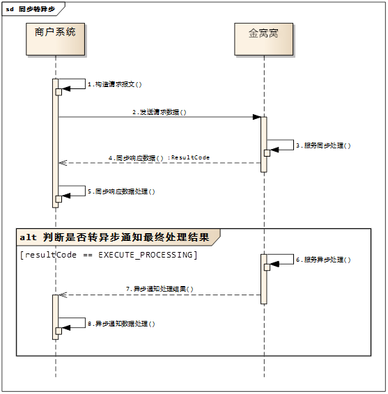
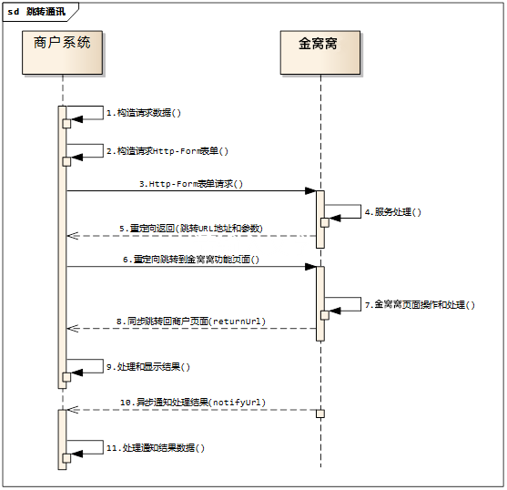

OpenApi开发规范
===============
---

## 1. 通讯协议
### 1.1. 通讯机制
文档中涉及的通讯机制和交互模式总共有四种，请文档使用开发人员特别注意各服务的通讯机制，便于正确的进行通讯对接。
#### 1.1.1. 同步通讯

1. **构造请求数据**：商户根据服务平台提供的接口规则，通过程序生成得到签名结果及要传输给服务平台的数据集合。

2. **发送请求数**：把构造完成的数据集合，通过页面链接跳转或表单提交的方式传递给服务平台。

3. **服务处理**：服务平台得到这些集合后，会先进行安全校验等验证，一系列验证通过后便会处理这次发送过来的数据请求。

4. **同步响应数据**：对于处理完成的交易，服务平台以同步响应的方式返回处理结果和数据，响应数据在同一个http连接的response报文的body体中返回，以JSON格式进行传输。

5. **响应数据处理**： 商户系统同步接收到http响应后，获取Http响应的body体中的JSON报文体，根据具体服务接口定义的结构解析获取数据后，进行商户系统的业务处理。

#### 1.1.2. 异步通讯

1. **构造请求数据**：商户根据服务平台提供的接口规则，通过程序生成得到签名结果及要传输给服务平台的数据集合。特别的为保障异步通知能正确的通知到商户系统，请保证服务器异步通知URL链接（notifyUrl）上无任何特别字符，如空格、HTML标签、开发系统自带抛出的异常提示信息等，也不能后接queryString。notifyUrl格式实例如下：
	>* http://merchant-site/notifyUrl.html (正确)
	>* http://merchant-site/notifyUrl.html?busiType=2 (错误，不能后接queryString)
	>* http://merchant-site/  notifyUrl.html (错误，url中间不能有空格)
	
2. **发送请求数据**：商户系统通过HTTP-POST方式发送请求数据到服务平台网关。

3. **服务同步处理**：服务平台接收商户系统请求数据，进行同步业务处理。

4. **同步返回结果**：服务平台同步响应商户系统服务同步处理结果，一般情况返回的结果如果是成功则表示请求已接收或完成部分处理，需要商户系统等待异步通知业务最终处理结果；如果是失败则表示业务处理已终止，无后续异步通知。

5. **同步返回数据处理**：商户系统收到服务平台同步响应数据后，进行相关的业务或状态处理。

6. **服务异步处理**：服务平台返回同步处理结果后，会继续异步处理业务逻辑（如：等待银行处理结果返回后，进行进一步处理等）。

7. **异步通知处理结果**：服务平台在异步完成业务处理，得到该笔业务最终处理结果后，通过商户系统请求时传入的notifyUrl, 使用http-post方式请求notifyUrl，通知最后处理结果。

8. **异步通知数据处理**：商户系统在成功收到异步通知后，需要在响应体(http响应的body中)中打印输出”success” （不包含引号）表示商户系统已成功收到异步通知。如果商户反馈给服务平台的字符不是success这7个字符，服务平台服务器会不断重发通知，直到超过24小时。一般情况下，25小时以内完成8次通知（通知的间隔频率一般是：2m,10m,10m,1h,2h,6h,15h）

#### 1.1.3. 同步转异步

同步转异步的主体交互模式完全同异步通讯。不同的是异步通知是可选的，只有在同步响应返回resultCode=EXECUTE_PROCESSING的时候才会有异步通知。具体在第5步的时候商户系统需要对返回的resultCode进行如下判断：
>* 如果resultCode=EXECUTE_PROCESSING,那么表示该业务返回时没有完成最终处理，当前正在处理中，需要等待后续异步通知最终结果；
>* 如果resultCode=EXECUTE_SUCCESS表示该业务已经完成最终处理，后续无异步通知。
>* 如果resultCode为其他值的情况表示处理错误响应，已经是最终结果，无后续异步处理。

#### 1.1.4. 跳转通讯

跳转通讯主要提供商户发起请求直接跳转到服务平台的页面进行业务处理的场景。如上图所示，主要流程描述如下：
 
1. **构造请求数据**：商户根据服务平台提供的接口规则，通过程序生成得到签名结果及要传输给服务平台的数据集合。

2. **构造请求http-form表单**：使用第1步签名后的完整报文，组织页面form表单或对应的POST报文，请求服务平台网关（如果是form表单，action为服务平台网关）。

3. **http-form表单请求**：把构造完成的数据集合，通过页面链接跳转或表单提交的方式传递给服务平台。

4. **服务处理**：服务平台得到这些数据后，会先进行安全校验等验证，验证通过后便会处理这次发送过来的数据请求。

5. **重定向返回**：完成服务处理后，服务平台使用重定向返回服务平台对应功能页面的URL和参数（queryString方式）。

6. **重定向跳转到服务平台功能页面**：用户浏览器收到重定向响应后，会自动重新请求跳转的地址，跳转到对应的服务平台功能页面。

7. **服务平台页面操作和处理**：用户在服务平台功能界面提交相关业务数据后由服务平台完成业务处理。

8. **同步跳转回商户页面**： 用户通过第7步完成业务操作后，服务平台请求第1步请求中的returnUrl，跳转回商户界面，同时通过get参数(queryString方式)同步通知处理结果。

9. **处理和显示结果**：商户系统收到同步通知后，可根据同步通知参数进行业务处理和界面显示。

10. **异步通知处理结果**：在完成同步通知和跳转后，服务平台会根据商户系统请求时传入的notifyUrl进行POST异步通知商户系统处理结果。处理默认同异步通讯。

11. **异步通知数据处理**：根据具体服务接口定义的结构解析获取数据后，进行商户系统的业务处理。

## 1.2 协议公共报文 
服务通讯协议使用HTTP POST/GET，采用给予MAC的签名保障通讯安全和认证。通讯方式主要采用HTTP同步或异步请求方式，字符编码统一使用UTF-8（如果有url作为参数的情况请进行URLEncoding）

#### 1.2.1. 公共请求结构
同步响应结果报文采用HTTP-POST方式请求，采用key1=value1&key2=value….格式。
<table width="100%" border="1" cellpadding="0" cellspacing="0" class="tableAPI">
	<tr>
		<th>参数名</th><th>参数说明</th><th>类型</th><th>必选</th><th>备注</th>
	</tr>
	<tr>
		<td>protocol</td><td>协议类型</td><td>S(16)</td><td>否</td><td>报文协议格式。httpPost(默认)</td>
	</tr>
	<tr>
		<td>service</td><td>服务代码</td><td>S(32)</td><td>是</td><td>接口服务代码。请根据接口服务定义填写。</td>
	</tr>
	<tr>
		<td>version</td><td>服务版本</td><td>S(8)</td><td>否</td><td>默认1.0</td>
	</tr>
	<tr>
		<td>partnerId</td><td>商户ID</td><td>SF(20)</td><td>是</td><td>签约的服务平台账号对应的合作方ID,由服务平台分配。定长20字符</td>
	</tr>
	<tr>
		<td>orderNo</td><td>请求订单号</td><td>s(20-40)</td><td>是</td><td>服务平台合作商户网站唯一订单号。长度：20-40字符。</td>
	</tr>
	<tr>
		<td>signType</td><td>签名方式</td><td>S(16)</td><td>否</td><td>目前支持MD5(默认), Sha1Hex, Sha256Hex, HmacSHA1Hex，请注意大写。</td>
	</tr>
	<tr>
		<td>sign</td><td>签名</td><td>S(32-64)</td><td>是</td><td>参见：2. 安全策略</td>
	</tr>
	<tr>
		<td>returnUrl</td><td>页面跳转返回URL</td><td>s(256)</td><td>否</td><td>服务平台处理完请求后，当前页面自动跳转(307重定向)到商户网站里指定页面的http路径。</td>
	</tr>
	<tr>
		<td>notifyUrl</td><td>异步通知URL</td><td>s(256)</td><td>否</td><td>当商户通过接口发起请求时，服务平台异步完成处理后，会主动连接该URL通知接口服务处理结果。</td>
	</tr>
</table>

#### 1.2.2. 公共响应结构
同步响应结果报文采用HTTP-BODY响应，采用JSON格式。
<table width="100%" border="1" cellpadding="0" cellspacing="0" class="tableAPI">
	<tr>
		<th>参数名</th><th>参数说明</th><th>类型</th><th>必选</th><th>备注</th>
	</tr>
	<tr>
		<td>success</td><td>成功标识</td><td>S(4)</td><td>是</td><td>表示接口调用是否成功。true：成功 false：失败</td>
	</tr>
	<tr>
		<td>protocol</td><td>协议类型</td><td>S(16)</td><td>否</td><td>报文协议格式。httpPost(默认)</td>
	</tr>
	<tr>
		<td>service</td><td>服务代码</td><td>S(32)</td><td>是</td><td>接口服务代码。请根据接口服务定义填写。</td>
	</tr>
	<tr>
		<td>version</td><td>服务版本</td><td>S(8)</td><td>否</td><td>默认1.0</td>
	</tr>
	<tr>
		<td>partnerId</td><td>商户ID</td><td>SF(20)</td><td>是</td><td>签约的服务平台账号对应的合作方ID,由服务平台分配。定长20字符</td>
	</tr>
	<tr>
		<td>orderNo</td><td>请求订单号</td><td>s(20-40)</td><td>是</td><td>服务平台合作商户网站唯一订单号。长度：20-40字符。</td>
	</tr>
	<tr>
		<td>signType</td><td>签名方式</td><td>S(16)</td><td>否</td><td>目前支持MD5(默认), Sha1Hex, Sha256Hex, HmacSHA1Hex，请注意大写。</td>
	</tr>
	<tr>
		<td>sign</td><td>签名</td><td>S(32-64)</td><td>是</td><td>参见：2. 安全策略</td>
	</tr>
	<tr>
		<td>resultCode</td><td>返回码</td><td>S(32)</td><td>否</td><td>返回码EXECUTE_SUCCESS：为处理成功，其他请参考“3.1 返回码”</td>
	</tr>
	<tr>
		<td>resultMessage</td><td>返回信息</td><td>S(128)</td><td>否</td><td>返回码描述信息</td>
	</tr>
</table>

#### 1.2.3. 公共异步通知结构 
同步跳转返回结果报文采用HTTP-POST方式请求，采用key1=value1&key2=value….格式。
<table width="100%" border="1" cellpadding="0" cellspacing="0" class="tableAPI">
	<tr>
		<th>参数名</th><th>参数说明</th><th>类型</th><th>必选</th><th>备注</th>
	</tr>
	<tr>
		<td>success</td><td>成功标识</td><td>S(4)</td><td>是</td><td>表示接口调用是否成功。true：成功 false：失败</td>
	</tr>
	<tr>
		<td>protocol</td><td>协议类型</td><td>S(16)</td><td>否</td><td>报文协议格式。httpPost(默认)</td>
	</tr>
	<tr>
		<td>service</td><td>服务代码</td><td>S(32)</td><td>是</td><td>接口服务代码。请根据接口服务定义填写。</td>
	</tr>
	<tr>
		<td>version</td><td>服务版本</td><td>S(8)</td><td>否</td><td>默认1.0</td>
	</tr>
	<tr>
		<td>notifyTime</td><td>通知时间</td><td>S(20)</td><td>是</td><td>通知的发送时间。格式为yyyy-MM-dd HH:mm:ss</td>
	</tr>
	<tr>
		<td>signType</td><td>签名方式</td><td>S(16)</td><td>否</td><td>目前支持MD5(默认), Sha1Hex, Sha256Hex, HmacSHA1Hex，请注意大写。</td>
	</tr>
	<tr>
		<td>sign</td><td>签名</td><td>S(32-64)</td><td>是</td><td>参见：2. 安全策略</td>
	</tr>
	<tr>
		<td>resultCode</td><td>返回码</td><td>S(32)</td><td>否</td><td>返回码EXECUTE_SUCCESS：为处理成功，其他请参考“3.1 返回码”</td>
	</tr>
	<tr>
		<td>resultMessage</td><td>返回信息</td><td>S(128)</td><td>否</td><td>返回码描述信息</td>
	</tr>
</table>

#### 1.2.4. 公共跳转通知结构
同步跳转通知的结构同异步通知结构，详情参考：“[1.2.3.公共异步通知结构](#noticCommonStructure "异步通知结构")”

#### 1.2.5 数据类型说明
1. S(x)：x为数字，表示字符串最大长度为x。s不区分大小写
2. S(x-y)：x和y为数字，表示字符串长度范围为：x-y，包含x和y
3. SF(x): x为数字，表示字符串固定长度为x。sf不区分大小写
4. n(x), x为数字，表示为数字类型，最大长度为x， n(x-y)和nf(x)与字符串同理。
5. m：表示money类型，支持两位小数点的元。如:2000.01，10000或100.00

### 1.3 服务地址
测试环境：

- http://test.domain:port/gateway.html
- https://test.domain:port/gateway.html

正式环境：

- http://online.domain:port/gateway.html
- https://online.domain:port/gateway.html

## 2. 安全策略
### 2.1. 认证机制
OpenApi的认证机制主要采用请求方生成报文签名，接收方验证签名的认证方式。通讯双方采用相同的算法和机制认证对方的请求合法性。主要步骤如下：

1. 商户在服务平台开户后，服务平台会通过邮件等方式发送商户安全码(secretKey)给商户。

2. 商户在发送请求报文前，使用商户的商户安全码对请求报文签名(clientSignature),并附带签名摘要值到请求报文中（参数名sign），一并发送请求到服务平台OpenApi。

3. 服务平台在收到请求报文后，根据请求报文中商户的商户号（partnerId）获取到商户的商户安全码，使用相同的算法对报文进行签名计算得到服务端签名(serverSignature)

4. 服务平台核对请求发送的客户端签名（clientSignation）是否与服务端签名（serverSignature）相同，如果相同则表示认证通过。
响应和异步通知认证机制与请求完全相同，只是双方角色互换。
目前主要支持的签名方式请参考：[2.2.1 签名算法](#signTypes "签名算法")
签名算法的实现请参考：[2.2.4 计算签名](#calcSign "计算签名")

### 2.2. 签名计算
#### 2.2.1 签名算法 
openApi提供4中签名认证算法，分别为：MD5, Sha1Hex, Sha256Hex, HmacSHA1Hex
#### 2.2.1 参与签名的参数
**请求报文** 
在请求参数列表(包括协议公共报文，请参考：[1.2.协议公共报文](#protocolCommonStruts "协议公共报文定义"))中，除去sign参数外，其他需要使用到的参数皆是要待签名的参数。

**响应报文** 
同步请求对应的响应报文，如具体服务没有特殊说明，默认情况下,以响应的协议公共报文（请参考：2.2.协议公共报文）除去sign作为待签名参数。

**跳转通知和异步通知返回** 
所有参数列表（包括协议公共报文，请参考：[1.2.协议公共报文](#protocolCommonStruts "协议公共报文定义")）中，除去sign参数外，凡是通知或返回回来的参数皆是要待签名的参数。

#### 2.2.3 生成待签名字符串 
1. 根据不同的报文场景（请求，响应，通知等），确定好待签名的数据项，按如下步骤进行组装待签名字符串明文。采用如下格式进行组装（参数数组,也可以使用集合或map）：

		string[] parameters={
			"aparam="
			"service=fastpay",
			"partnerId=20121015300000032621",
			"returnUrl= http://www.test.com/jinvovo/return_url.asp",
			"orderNo=6741334835157966", 
			"tradeName=xxx电视机", 
			"tradeAmount=100"
		};

	**参数组装注意：**
	>
	- 所有参数值在待签名字符串中采用UTF-8编码原始字符串，中文或特殊字符无需进行URL-Encode，只是在传输时，才需要对中文或特殊字符进行URL-Encode。
	- 没有值的参数(null或空字符串)无需传递也需要传递（如：key1=），也需包含到待签名数据中。
 
2. 对参数数组或集合成员按字符ASC码的顺序排序，若遇到相同首字符，则按第二个字符进行排序，以此类推。排序完成之后，再把所有数组值以“&”字符连接起来，得到的待签名字符串。如下stringToSign：

		aparam=&orderNo=6741334835157966&partnerId=20121015300000032621&returnUrl=http://www.test.com/jinvovo/return_url.asp&service=fastpay&tradeAmount=100&tradeName=xxx电视机

#### 2.2.4 计算签名
这里假设商户分配的商户安全码（20字节）为：secretKey=12345678901234567890

**MD5,Sha1Hex和Sha256Hex签名**

这三种算法的计算方式过程相同，具体计算过程如下：

1. 以待签名字符串（stringToSign）后接无空格和连字符的商户安全码（secretKey）作为签名的入参字符串（waitForSignString）, waitForSignString的demo如下：
orderNo=6741334835157966&partnerId=20121015300000032621&returnUrl=http://www.test.com/jinvovo/return_url.asp&service=fastpay&tradeAmount=100&tradeName=xxx电视机12345678901234567890

2. 转换入参字符串为二进制数组，编码采用UTF-8（Java代码如：waitForSignString.getByte("utf-8")）,得到签名入参的二进制格式数据（waitForSignBytes）。

3. 使用MD5,Sha1或Sha256算法对waitForSignBytes进行摘要签名。得到签名在结果二进制数组数据（signatureBytes）

4. 对签名输出的结果二进制数组(signatureBytes)进行16进制的字符串编码，得到最后的签名字符串（signature）

>**算法表达式：** 
String signature = Hex(digest (stringToSign+secretKey))
其中digest算法可以为：MD5, Sha1Hex, Sha256Hex

计算结果说明：

- MD5算法计算结果为32字节字符串。 如：`aedef2f1a771a7f3071bd93ed1338faf`
- SHA1算法计算结果为40字节字符串。 如：`84ed4ec9f8b45c6ea32bae6d92071f1ab3934b04`
- SHA256算法计算结果为64字节字符串。 如：`aa491f4f822ee2e398498e02f785dbfc4b6ff2d8165d055e44d8fd8be3994c4d`

**HmacSHA1Hex签名**

1. hmac签名需要两个基本参数，分别为待签名的字符串和签名key。我们使用待签名字符串（stringToSign，请参考：[2.2.3.生成待签名字符串](#generateWaitingForSign "生产待签名字符串")）作为第一个参数，分配给商户的商户安全码（secretKey）作为第二个参数。

2. 转换两个入参字符串为二进制数组，编码采用UTF-8（Java代码如：stringToSign.getByte("utf-8"); secretKey.getBytes("utf-8")）,分别得到签名入参的二进制格式数据（stringToSignBytes和secretKeyBytes）。

3. 使用HmacSHA1算法，使用secretKeyBytes作为Key对stringToSignBytes进行签名。得到签名结果输出为二进制数组数据（signatureBytes）

4. 对签名二进制结果数组(signatureBytes)进行16进制的字符串编码，得到最后的签名字符串（signature）

>**算法表达式：** 
String signature = Hex(hmacSHA1 (stringToSign，secretKey))

### 2.3. 数据加密

Openapi允许商户将请求的某些敏感字段加密后在进行签名和传输，保证敏感数据的私密性。服务请求报文定义中需要加密的字段会在备注中明确标出，请以具体的服务请求报文定义为准。单字段加密说明如下：

- 算法类型：对称加密
- 加密算法：AES-128位无填充向量
- 加密秘钥：商户安全码（secretKey）前16字节字符串对应的byte数组（secretKey.getBytes("utf-8")）
- 明文：加密明文编码为UTF-8的byte数组
- 密文：加密输出的二进制数据采用base64编码后作为最后加密的输出。

>如响应和通知报文中有明确标出需要加密传输的字段，请商户端采用相同的算法和秘钥进行解密等到字段明文。

### 2.4. 传输编码

请求报文和响应报文都根据以下几种情况，需要对报文的参数值进行UTF-8的URL-Encode编码后再进行传输。

1. 参数值中有包含中文
2. 参数值中有ISO-8869-1字符集中不支持的特殊字符，如：全角字符等
3. 参数值中有JSON表达式
4. 参数值中有XML或HTML标签

**特别说明：**

- 只有在传输时的数据需要编码和解码，签名和验签时请不要进行URL-Encode编码。
- 如果希望处理简单，在传输时对所有参数值进行URL-Encode。
- 如果使用POST方式的浏览器提交方式，可以不进行编码。

## 3. 返回码及说明
### 3.1. 返回码
**系统返回码**
<table width="100%" border="1" cellpadding="0" cellspacing="0" class="tableAPI">
	<tr><th>返回码</th><th>返回码说明</th></th></tr>
	<tr><td>EXECUTE_SUCCESS</td><td>成功</td></tr>
	<tr><td>EXECUTE_PROCESSING</td><td>处理中</td></tr>
	<tr><td>INTERNAL_ERROR</td><td>系统内部错误</td></tr>
	<tr><td>SERVICE_NOT_FOUND_ERROR</td><td>服务不存在</td></tr>
	<tr><td>PARAMETER_ERROR</td><td>参数错误</td></tr>
	<tr><td>PARAM_FORMAT_ERROR</td><td>参数格式错误</td></tr>
	<tr><td>UNAUTHENTICATED</td><td>认证(签名)错误</td></tr>
	<tr><td>UNAUTHORIZED</td><td>未授权的服务</td></tr>
	<tr><td>ORDER_NO_NOT_UNIQUE</td><td>商户订单号不唯一</td></tr>
	<tr><td>FIELD_NOT_UNIQUE</td><td>对象字段重复</td></tr>
	<tr><td>REDIRECT_URL_NOT_EXIST</td><td>重定向服务需设置redirectUrl</td></tr>
	<tr><td>PARTNER_NOT_REGISTER</td><td>合作伙伴没有注册</td></tr>
	<tr><td>PARTNER_NOT_PRODUCT</td><td>商户没有配置产品</td></tr>
</table>

**业务返回码**

业务及支付相关的返回码请根据具体接口定义判断处理。

### 3.2 返回码说明
当客户端（接口调用者）与服务端交互发生错误，服务端返回的响应中包含错误信息描述，描述格式为JSON格式。通过定义不同的错误码，并对错误码进行简要的信息描述，供接口调用者进行分析定位。

JSON的描述信息中包括公共响应头中非空的内容。格式如下：
 
	{
		"orderNo" : "417010237f8ae35d08d7d92a340889db",
		"partnerId" : "20140519020000011739",
		"protocol" : "httpPost",
		"resultCode" : "Unauthorized",
		"resultMessage" : "未授权的服务",
		"service" : "XXXXXX",
		"version" : "1.0",
		"sign" : "3221e42123665041ff13ad048e9e2d3d",
		"signType" : "MD5"
	}

返回的数据项说明请参考: [1.2.协议公共报文](#protocolCommonStruts "协议公共报文定义")

### 3.3 结果判断
所有交易同步响应和异步通知的响应结果中都有resultCode数据项，请根据resultCode的响应值判断交易的最终结果。具体判断方法如下：

- resultCode=EXECUTE_SUCCESS : 表示最终结果为成功。
- resultCode=EXECUTE_PROCESSING：表示交易正在处理中，需要等待异步通知来确定最终交易结果
- resultCode=其他： 表示交易错误或失败。

